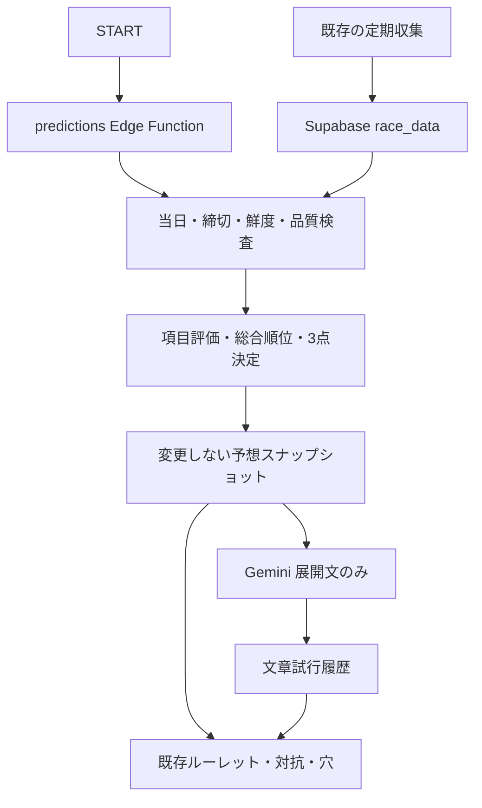

# v0.1.13 DBに基づく3連単予想 — 基本設計書

作成日：2026-09-21 JST。状態：レビュー版。設計書作成のみ。実装・DB変更・公開・プッシュは未実施。

関連：[詳細設計書](PREDICTION-DETAILED-DESIGN-v0.1.13.md)、[設計レビュー・未決事項](PREDICTION-DESIGN-REVIEW-v0.1.13.md)。未決事項は実装前に解決する。過去のヒアリングは[UI詳細設計のv0.1.13追記](design/UI-DESIGN-v0.1.12-DETAILED.md)と[HISTORY](../HISTORY.md)に残す。本書で過去の合意を無断で確定・変更しない。

## 1. 目的と範囲

v0.1.12のスマートフォンUIを維持し、ローカルの固定重みと抽選による予想を、Supabaseに収集済みの競艇データから計算する方式へ置き換える。本命・対抗・穴をバックエンドで決定し、Geminiは根拠に沿ったレース展開文だけを生成する。

対象：当日開催・締切前のレース選択、スコア計算、3点生成、文章生成、証跡保存、再利用、障害診断。コメントAI・OFUSE・コメント入力・背景デザイン・データ収集間隔は変更対象外。Web検索、オッズ、学習による自動配点調整、全期間バックフィル、履歴閲覧UI、詳細JSON圧縮は追加しない。

初期値は検証前の仮説であり、点数は確率ではない。旧方式より的中率が上がることは本設計だけでは確認できない。性能評価は未来情報を除外した時系列バックテストで行う。

## 2. 現行構成と変更境界

コード確認基準：`f277fa0`。実クラウドの状態は今回未照合。

| 現状 | v0.1.13の計画 |
|---|---|
| `script.js`のSTADIUM_DATA・calculateDistribution・selectCombination | 予想経路で使用を終了し、新しいprediction APIの結果を演出する |
| GitHub Pagesの静的画面 | 当日選択肢と予想結果のみ取得。秘密鍵を置かない |
| race-ingest → race_dataの版付きデータ | 既存収集を維持。採用済み版を読み取るアダプターを追加 |
| comments Edge Function、Gemini API | コメントは独立して維持。展開文生成は別モジュール |
| 元データ・正規化行・日付head | 予想に使った版と算出履歴を固定して保存 |

START時に非公式APIへ再収集を要求しない。公開されたDB版から一貫した入力を読む。収集と予想の障害を分ける。

## 3. 確定した評価枠

| ID | 項目 | 公称配点 | 方針 |
|---|---|---:|---|
| C01 | 進入コース・枠番 | 18 | 展示進入を優先、なければ枠番を代理。重複加点なし |
| C02 | 選手のコース別成績 | 16 | 過去結果を算出し全国共通基準で評価 |
| C03 | モーター | 14 | 2連対率70%＋3着追加率30%、6艇相対 |
| C04 | ST | 12 | 平均ST80%＋F/L信頼性20% |
| C05 | 直前展示 | 12 | 展示タイム55%＋展示ST40%＋チルト5% |
| C06 | 選手の実力・近況 | 9 | 全国・当地6点（60:40）＋直近10走3点（3連対率:平均着順=60:40）。今回追加確認済み |
| C07 | 会場・風・波 | 7 | 会場平均との差4、風2、波1 |
| C08 | 級別 | 5 | A1/A2/B1/B2の段階式 |
| C09 | 今節成績 | 4 | 正式得点率優先、再現できなければ平均着順 |
| C10 | ボート成績 | 2 | モーターと同じ分解・相対評価 |
| C11 | 体重・整備 | 1 | 体重・調整体重0.6、整備0.4 |
| 合計 | | 100 | 欠損等を除外し100点換算 |

2026-09-21追加確認：C07、C05のチルト、C11は補正表確定まで採点除外。さらにD05の確定により、C04のF/L信頼性2.4点は対象期間・意味を確認できるまで採点除外する。データは保存するが、根拠なく加点・減点しない。公称配点は維持し、有効満点から除外する。当面の有効満点上限は100−7−1−0.6−2.4＝89.0点。最終総合点は引き続き100点換算する。

### v0.1.14の実装範囲

100点の配点表は将来の最終設計として維持する。v0.1.14で実装・採点する基本最大配点は、仕様未確定の項目を推測で加点しないため、次の66点に限定する。

| 実装項目 | 有効最大配点 |
|---|---:|
| 進入コース・枠番 | 18 |
| 能力（全国・当地勝率） | 6 |
| モーター | 14 |
| 平均ST | 9.6 |
| 展示タイム | 6.6 |
| 展示ST | 4.8 |
| 級別 | 5 |
| ボート | 2 |
| **v0.1.14基本最大** | **66** |

各艇は欠損状況に応じた`effectiveMaximum`を持ち、`finalScore = earned / effectiveMaximum × 100`で換算する。次の34点は最終設計には残すが、v0.1.14では採点しない：コース別成績16、直近10走3、今節成績4、会場・風・波7、体重・整備1、F/L信頼性2.4、チルト0.6。特に最初の23点は基礎データがあっても、集計期間・最低サンプル数・異常結果・節ID等が未確定のため実装しない。

D02確定：展示タイム6.6点と展示ST4.8点は、小項目ごとに6艇全ての有効データが揃った場合だけ採用する。1艇でも欠けた小項目は全艇から除外し、残った小項目へ再配分しない。両小項目が揃えば有効満点11.4点、両方が不成立なら11.4点全体を除外する。

D05確定：展示STにF又はL表記が1艇でも含まれる場合、そのレースの展示ST4.8点を全艇から除外する。Fを表す負数も通常の速いSTとして評価しない。採点除外した展示STは穴評価・同点比較にも使わず、原表記と除外理由を保存する。

全国共通評価は艇ごとの欠損を除外する。相対評価は必要値が6艇全て揃う場合だけ採用する。これは欠損による不利を軽減する規則であり、情報量が異なる艇同士の完全な公平性は保証しない。各艇の有効満点と欠損理由を必ず保存する。

## 4. 順位と3点

最終点＝取得済み得点合計÷有効満点合計×100。内部値で降順比較し、完全同点時のみ展示タイム、展示ST、平均ST、モーター評価、枠番昇順で比較する。

- 本命：総合1位→2位→3位。
- 対抗：総合2位→1位→4位。
- 穴：総合4〜6位を展示タイム30%、展示ST30%、モーター25%、平均ST15%で再評価し、1着艇を決定。2着・3着は残る総合上位2艇。

穴は「総合評価は低いが上振れ材料がある艇」。高配当や人気薄を意味しない。同じ有効入力と設定なら同じ数字を出す。文章の同一性はモデルの性質上保証せず、成功済み文章の再利用で不要な変化を抑える。今回追加確認：6艇が揃わなければ3点とも生成しない。穴評価材料が全て欠ける場合は穴だけ「—」とし、本命・対抗を捨てない。

## 5. 時点・鮮度・選択

当日とはサーバーのAsia/Tokyo日付。展示進入は本番進入の予測材料であり本番確定値と呼ばない。対象レースのresultは予想入力に混ぜない。過去結果も予想時点に観測できた版だけ使う。

展示前は最終検証済み取得から30分以内、展示情報取得後は10分以内を初期鮮度基準とする。API取得時刻と提供元更新時刻は区別する。レース単位更新時刻がなければnullとし、HTTP Last-Modifiedを代入しない。freshは当方の取得鮮度を示すだけで、公式の最新状態との一致を保証しない。

締切以上（now >= closed_at）、中止・成立済み、締切不明、staleでは新規計算を禁止。再利用時にも現在の締切・鮮度を先に確認する。

会場は当日開催だけ、レースはその会場の全Rを表示し締切済みを灰色・選択不可とする。「disabled」という文字は表示しない。選択可能Rがゼロの会場を残すかは旧追記と会話に差があるためD08で確認する。開催情報の説明文や履歴一覧は追加しない。

## 6. 永続化・再利用

計算結果はprediction_idごとに不変とする。元入力・履歴集計・除外・設定全文・バージョン・ハッシュ・日時を保存する。履歴は原則削除しない。圧縮は初期対象外。

同じレース＋入力ハッシュ＋スコア設定版＋ロジック版が一致したら計算を再利用する。取得時刻だけ変化して内容が同じ場合も再利用できるよう、取得観測と入力ハッシュを分ける。バージョンに対応する設定内容は変更しない。

Gemini再試行は予想本体を書き換えず、同じprediction_idに文章試行レコードを追加する。文章再利用はさらにモデル・プロンプト版・文章用入力ハッシュの一致が必要。古い予想の文章再試行が、新しい予想の表示優先順位を逆転させてはならない。

## 7. 状態と画面

| 状態 | 数字 | 展開文 |
|---|---|---|
| success | 表示・保存 | 表示・保存 |
| partial | 表示・保存、欠損根拠を保存 | 取得済み事実だけで生成 |
| gemini_error | 計算結果を表示・保存 | 「生成できませんでした」 |
| stale | 新規予想なし | エラー理由を短く表示 |
| api_error | 必要データ取得・品質・保存失敗。新規予想として表示しない | 診断コードで原因を分ける |
| closed | 新規・再予想禁止 | START無効化 |

計算のpartialと文章の失敗は同時に起きるため、内部は計算状態と文章状態を別管理する。今回追加確認：総合点・順位はAPIとDBへ保存し、既存UIに新しい一覧表示は追加しない。

## 8. 安全な導入・切り戻し

追加スキーマと専用Functionで既存コメント・収集表を破壊しない。新旧版の前方互換を確認する。v0.1.10/v0.1.11/v0.1.12タグを書き換えない。初期公開はユーザー承認後。新規予想機能停止→フロントをv0.1.12へ戻す→新規Function停止でUIを戻し、保存した予想は残せる。

v0.1.10への完全切り戻しでは収集Cronやcommentsも対象となり、Gitだけでは戻らない。既存復元資料・DBバックアップ・Secret名と稼働構成を確認し、復元試験をしてから「いつでも戻せる」と判断する。今回確認したのはローカルタグの存在まで。

## 9. 完了条件

基本設計レビュー完了と実装着手可能を区別する。詳細設計D01〜D09の必要な判断、実データ型の確認、各段階5件以上の試験設計、旧版復元計画が揃うことを着手条件とする。今回の成果物は設計文書であり予想精度・クラウド動作の検証済み報告ではない。

## v0.1.14 追記 — 実装前の確定事項

### generation lease

- lease有効時間は45秒とする。Geminiの初期タイムアウト15秒とDB処理時間を含めた設定値で、変更可能にする。
- 正常にsnapshotが保存された場合は、後続要求がsnapshotを検出するため、leaseの自然失効を待つ。保存前の処理失敗も同じく自然失効で回収する。
- タイムアウトしたleaseは、次回同じ`reuse_key`の要求が期限切れを検出して再取得する。別の回収ジョブは初期実装では作らない。
- 同じ`reuse_key`で同時要求された後続は待機せず、HTTP 202と`generating`、再試行目安秒数を返す。保存済みなら既存snapshotを返す。
- `reuse_key`はレース、入力ハッシュ、スコア設定版、予想ロジック版から生成し、snapshot側で一意化する。

### migrationと権限

クリーンDBへの適用順は、(1) `race_prediction`スキーマとsnapshot・lease、(2) snapshot作成・lease取得RPC、(3) `narrative_attempts`、(4) narrative読取・保存RPC、(5) service_role権限とpublic互換RPCの確定、の順とする。現行migrationはこの依存順で作成されている。

予想テーブル、leaseテーブル、内部RPCは`anon`・`authenticated`・`public`から直接利用できない。公開RPC名を維持する互換wrapperもEXECUTEは`service_role`だけに付与し、Edge Functionがservice_roleで呼び出す。

### Gemini初期設定

文章生成用の初期設定は、モデル`gemini-3.1-flash-lite`、タイムアウト15秒、最大出力1024 tokens、450〜650文字の3段落、プロンプト版`v0.1.16-narrative-3`とする。すべて環境設定で変更可能とし、`GEMINI_API_KEY`はEdge FunctionのSecretからのみ読む。実本番値は適用前に確認する。

### E2E合格条件

クリーンDBまたは検証用DBで、レース取得、予想計算、snapshot保存、Gemini文章生成、`narrative_attempts`保存、APIレスポンス、Web表示を1本通す。加えて同一入力の同時2要求でsnapshotが1件だけ作成され、後続が`generating`または既存結果を受け取ることを合格条件とする。

### ロールバック

コードとEdge Functionをv0.1.13へ戻し、予想機能を停止する。`race_prediction`のsnapshot・文章履歴・leaseデータは削除せず残す。既存の`race_data`収集とcommentsは変更しない。予想機能を再開するときはv0.1.14以降のmigration状態とコード版の整合を確認する。

### v0.1.14 score-3 公開前修正

負の展示STは全艇の展示ST採点・穴評価・文章根拠から除外する。展示タイム同点比較はtimeを参照する。configVersionはv0.1.14-score-3。

components.included[].earnedは、その項目を採点可能な艇だけの平均寄与点（欠損艇を0点で含めない）。included[].maximumは項目の配点。components.earnedとmaximumはそれぞれincludedの合計であり、各艇のeffectiveMaximumの平均ではない。艇別得点・順位計算にはこの診断集計値を使用しない。

入力ハッシュはレース識別情報と、艇番・氏名・進入コース・級別・平均ST・全国/当地勝率・モーター/ボート2連対率と3連対率・展示タイム・展示STの明示的許可リストを固定順に構成し、configVersionとlogicVersionを含める。採点除外値はnullにし、数値文字列は数値へ正規化する。氏名は数値採点ではなく保存予想と文章の人物同一性のため保持する。取得時刻・batch_id・result・その他管理情報は含めない。締切と鮮度は再利用前に毎回確認する。

画面の生成待ちはretryAfterに従い最大5要求・60秒。200の有効予想のみ描画し、失敗・タイムアウトは操作可能状態へ戻す。締切欠損・不正はdeadline_unavailableで生成停止。旧snapshotは保持する。
