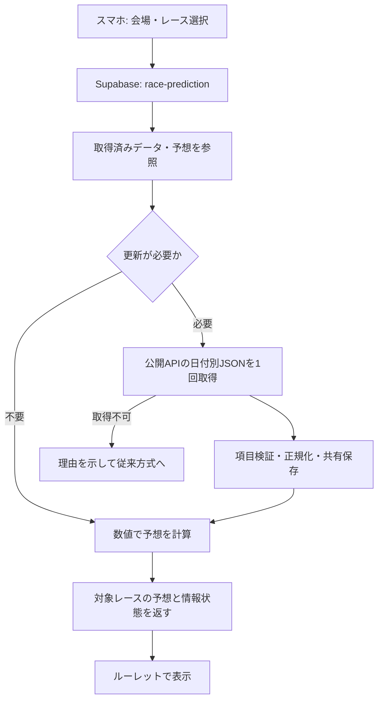

# 実レース情報を使う予想機能 — 設計・実装計画

作成: 2026-09-17 22:55 JST

状態: 段階1〜2の初回実装を反映済み。UIは変更せず、本命1点取得の試験運用を開始。キャッシュ用DBマイグレーションはローカルに準備済みだが、CLIのIPv6接続制約によりSupabase DBへは未適用。Edge Functionはデプロイ済み。

## 1. 目的と今回の方針

- 個別の許可申請と返答待ちを開発の前提にしない。公開API `boatraceopenapi/api` のJSONをプログラムから読む構成を採用候補とする。
- 公式サイトを自動巡回するクローラーや、生成AIに公式サイトを閲覧させる機能は作らない。API障害時も公式サイトへの直接取得に自動転換しない。
- 情報取得、正規化・保存、予想計算、ルーレット表示を独立させる。将来は情報提供元だけ差し替えられるようにする。
- 目標は3連単の的中率向上。取得元の違いを「公式8点・非公式6点」と採点する根拠はない。同じ入力と計算方法なら予想も同じになる。
- 最初はオッズを予想入力に使わない。提供APIにもオッズはない。将来の「本命・対抗・穴」は後続段階で扱う。

## 2. 公開条件をどう扱うか

確認したREADMEはJSONの利用方法を案内しており、個別申請・契約・APIキー発行の手順は記載していない。これを根拠に公開エンドポイントを利用する設計を進める。申請を必須とする新たな工程は追加しない。

ただし、MITライセンスの本文が対象とするのはソフトウェアと関連文書である。元データの第三者の権利まで一括して許諾・保証されたとは扱わない。「申請不要だから権利上も全面的に問題なし」と断定しない。

- 公開画面の案内に非公式APIの出典と遅延の可能性を表示する。
- 初期版は予想に必要な項目と予想結果の提供に絞り、取得した一日分のJSONをそのまま公開・再配信する機能は設けない。
- 提供元のコードをコピーする場合は、MITの著作権・許諾表示を保持する。自作の取得アダプターでも出典を記録する。
- 利用条件の変更、提供停止、利用停止要請があれば、提供元を無効化して従来方式へ切り替えられるようにする。

これは現在確認できた公開資料に基づく運用上の判断であり、すべての利用権限の保証ではない。

## 3. 既存環境の確認結果

| 対象 | ローカルで確認した状態 |
| --- | --- |
| サイト | GitHub Pages向けのHTML・CSS・JavaScript。`index.html`、`script.js` など |
| 現行の予想 | `script.js` の `STADIUM_DATA` とIPFで120通りの3連単分布を作り、`selectCombination` で抽選 |
| 選択項目 | 会場とレース番号のUIはあるが、現行予想処理は会場だけを使う |
| 統計の期間 | READMEには2025-08-01〜2026-07-31と記載。元統計そのものの再監査は未実施 |
| バックエンド | Supabase Project-012、参照ID `jxjxqfrtvdpvrifktxsf`。コメント用Edge Functionとマイグレーションあり |
| Git | ローカルmainは `e5ab224`。既存の `HISTORY.md` に未コミットの12行の追記あり |
| 復元基準 | `v0.1.10` タグの参照先コミットは `ddf3e476d65f8625602e10669322434c2a7f475d` |

READMEにはコメント未実装という古い説明が残る。`index.html` のバージョン表示もv0.1.9になっている。これらはGitタグで特定したv0.1.10の基準と区別し、将来リリース時の確認項目とする。この計画作成では修正しない。

以前の履歴照合は少数・桐生中心で、精度や全場の完全性は保証しない。進入・展示STの公式照合は未完了と扱う。会話中に確認した空欄は「前走成績」内の進入・ST欄だった可能性があるため、「公式に展示進入・展示STがない」とする根拠にはしない。今後の試験ではAPI内の展示と本番結果を確実に区別する。

## 4. 全体構成

実行はGitHub PagesとSupabase上で完結させる。作業PCの常時起動は不要な構成。予想計算にはGeminiを呼ばず、既存のAIタカシのコメント返信と独立させる。

## 5. 情報取得とキャッシュ

### APIと入力

- 取得URL: `https://boatraceopenapi.github.io/api/v1/YYYY/YYYYMMDD.json`。
- 日付は日本時間でサーバーが決定する。当日版に前日分を混ぜない。
- 場コードは01〜24、レースは1〜12の対応表で検証する。利用者が任意の外部URLを指定できる仕組みは作らない。
- 公開エンドポイントの利用者入力は会場・レースのみとする。過去日付の取得と管理用の強制更新は管理者用試験ツールに限定する。

### 初期設定案（実測後に調整）

| 項目 | 初期案 |
| --- | --- |
| 更新のきっかけ | 会場・レース選択後とSTART時。画面操作の連続発生はまとめる |
| 上流APIへの最短アクセス間隔 | 同じ日付について全利用者合算で180秒 |
| 通信待ち | 1回最大8秒。操作中の自動連続リトライなし |
| 同時アクセス | DBで短い取得権を確保し、複数のFunction起動でも日付別に取得を1本へまとめる |
| 通信サイズ | 上限8MiB。超過時は解析せずエラーとして記録 |
| 失敗後 | 取得権は期限付きで解放。次回試行まで待機時間を設ける。429はRetry-Afterを尊重 |
| 需要がない時間 | 初期の公開機能では定期取得しない |
| 保存 | 当日キャッシュは上書き、前日分は翌々日までに整理。評価用の少数スナップショットは別保存 |

同時実行対策はメモリ内の変数だけに頼らず、DBの原子的な取得権確保で実装する。一日分のJSONをレースごと・端末ごとに取り直さない。ETag等が実際に使える場合は条件付きGETを追加する。

取得時刻、上流の更新時刻（提供される場合のみ）、内容のハッシュ、直前情報の有無を別々に保存する。上流更新時刻が不明ならnullとし、取得時刻を「公式の情報更新時刻」と表示しない。上流の約3分更新と自サイトのキャッシュ待ちが重なるため、締切直前の最新情報を保証する機能にはしない。

### 取得失敗・欠損の扱い

- `ready_preview`: 出走表と必要な直前項目が揃う。「展示反映」と取得時刻を表示できる。
- `ready_entry`: 出走表は揃うが展示が未反映。「展示未反映」と明示し、出走表用の計算を使う。
- `unavailable` / `invalid` / `stale`: 取得失敗、不正構造、期限を過ぎて更新できない。実データ版の新しい予想は返さず、「実レース情報を取得できないため通常ルーレット」と表示する。
- `closed`: サーバー時刻が取得済み締切日時を過ぎた、または結果が既にある。新規予想を止め、保存済み予想があれば過去の予想として表示する。
- 欠場・中止・日程変更を十分に判定できないレースは実データ版の対象外にする。不明を開催中と決めつけない。未開催場は選択状態を知らせる。

更新時刻が不明な上流の古さまでは完全に検出できない。表示名は「最新予想」や「締切直前情報」ではなく、使用項目の状態を示す。サーバーから締切判定を返した後に画面上でも時刻を確認し、長時間開いたままのページが新規予想を続けないようにする。

## 6. データの正規化と保存設計

必要な概念を次のテーブルに分ける。具体的なDDLは実装段階で作成する。

| テーブル案 | 用途・主な項目 |
| --- | --- |
| `race_fetch_state` | 提供元・日付、取得権期限、最終試行・成功、ETag、エラーコード、取得回数・通信量 |
| `race_data_cache` | 日付・場・R、締切、正規化した出走表と展示、結果の有無、取得時刻、内容ハッシュ、形式バージョン |
| `race_predictions` | 日付・場・R、入力ハッシュ、計算版、上位3点、入力状態、生成時刻、検証用の入力スナップショット |
| `race_evaluations` | 保存予想に対応する結果、的中判定、対象外理由。予想生成から独立させる |

キャッシュ更新は日付と整合性を検証してから公開する。結果は評価側へ渡し、予想入力には許可した出走表・展示項目だけを組み立てる。元JSONをそのまま予想器へ渡さない。

RLSとテーブル権限で利用者による直接読み書きを禁止し、service-roleで動く専用Functionから必要なレスポンスだけを返す。公開APIキーやCORSだけではアクセス制限にならないため、リクエスト上限・共有取得制限・入力検証も使う。コメント用テーブル、制限キー、RPCには依存させない。

初期の評価スナップショット保持は30日を案とする。予想と入力を組で削除し、評価集計を別に保持する。保存量の実測を見て期間と対象レース数を調整する。既存コメントの保存方針を変更するものではない。

### 項目ごとの取り扱い

- 枠番、選手登録番号、会場コードで対応を取る。名前の空白表記をキーにしない。
- 欠損と0を分ける。全国・当地「勝率」は着順点の指標であり、1着になる確率ではない。1着率として使用しない。
- 平均STと展示STを分ける。展示の進入は、本番で確定する進入ではない。Fを含む展示ST文字列の変換は実サンプルで確かめる。
- 展示タイムは同一レース内の相対比較を基本にする。会場の異なる生タイムを同じ尺度で足さない。
- 風向は方位とレース場の向きを区別する。各場の向きの対応が未確認なら追い風・向かい風へ勝手に変換しない。
- ボート・モーター番号は場と使用期間をまたいだ同一機材識別子ではない。長期の成績を番号だけで結合しない。
- 直近の個別成績やコース別1着率など、今回のスキーマで確認できない項目は「取得可能」と約束しない。必要なら、提供APIから取得できる過去結果だけで別途集計する。

## 7. 予想の計算方法

### 比較する3方式

1. A: v0.1.10の会場統計分布から抽選する現在方式。
2. B: 同じ会場統計分布から上位1点・3点を選ぶ方式。
3. C: 出走選手、平均ST、全国・当地成績、モーター等、利用可能なら展示を加えた方式。

AとCだけを比較すると、抽選をやめた効果と実データを加えた効果が混ざる。Bも比較して実データの寄与を測る。Aは乱数を固定した反復または分布から計算する期待的中率を使い、たまたまの抽選結果だけで評価しない。3点比較では同じ点数・重複なしという条件を揃える。

### 段階的なモデル

- 初版は会場別の120通りの分布を基準に、各選手の特徴を着順別に補正し、全体を正規化して上位候補を作る。係数と入力項目はバージョン管理する。
- 係数は学習用の過去期間で調整し、後の未使用期間で評価する。仮の重みを「正確な確率」と表示しない。率の母数が不明な項目は極端な値を過信しない。
- 展示ありと展示なしを別に評価する。欠損項目を0点で埋めることによる不当な減点を避ける。
- 改善が認められた後で、内側艇と外側艇のST差、展示進入と枠順の違い、隣接艇の組合せなどの相互作用を追加し、逃げ・差し・まくりを扱うモデルへ広げる。初版で展開を読めていると説明しない。
- Geminiによる予想・Web検索・毎回の文章解説は初期対象外。取得と数値計算の生成AIトークン消費は0。Supabaseの通信・保存・実行コストは別に測る。

入力内容と計算版が同じなら結果も固定する。取得時刻だけ変わって内容が同じなら再計算・重複保存はしない。新しい情報で予想が変わる場合は、使用入力と変更前後の予想を追えるようにする。

## 8. 画面とレスポンス

- 会場とRの選択値を予想APIへ渡す。切り替え前の遅い応答で別レースの表示が上書きされないよう、応答のレースキーと要求番号を検証する。
- 取得中はSTARTの二重操作を防ぐ。結果確定後に既存の減速・停止演出へ渡す。スロットの表示順（1着、2着、3着）と停止順（3着、2着、1着）を維持する。
- 初回統合は既存3リールに本命1点を表示する。予想APIは上位3点を返せる構造にして、対抗・穴の見せ方は後続のUI確認で決める。
- 「穴」は人気やオッズを使わず高配当を保証できないため、単純な第3候補と区別する。的中率評価はまず上位3点で行う。
- 状態表示は「展示反映」「展示未反映」「通常ルーレット」などに絞る。取得時刻と非公式の出典を確認できる小さな案内を付ける。
- レスポンスはレースキー、締切、情報状態、入力ハッシュ、計算版、上位候補、取得時刻を含む。全場の元JSON、秘密情報、管理用診断は返さない。

## 9. 実装フェーズと完了条件

| 段階 | 作業 | 完了の判断 |
| --- | --- | --- |
| 0 復元準備 | v0.1.10の参照先、現行DB・Function・公開資材の状態を記録。開発ブランチ作成は実装開始時 | 従来方式の保存、専用の追加範囲、停止手順が明確 |
| 1 取得試作 | CLIで日付別JSONを取得・検証し、レース単位に正規化。少数の試験データと試験画面を作る | 正常・欠損・未開催・異常JSONを識別。出走表と結果の混入がない |
| 2 クラウド取得 | 専用Function・キャッシュ・共有取得制御・診断を実装。許可後にSupabaseへ反映 | PC停止中でも取得可能。同時要求で上流への重複取得なし。障害時の表示を確認 |
| 3 計算・過去評価 | A/B/C方式とCLI評価を作り、複数会場・期間で比較する | 同点数で再現可能な評価報告。後から得た結果・情報を予想へ入れない |
| 4 締切前の試験 | 選んだ会場で、締切前に入力と予想を保存。結果後に自動照合 | 実際の情報反映、取得成功率、的中率、対象外率を測定できる |
| 5 ルーレット統合 | 既存UIへ接続。表示・障害・切り戻しを試験 | Android ChromeとiOS Safariで正常表示し、レース選択と予想が一致 |
| 6 公開判断 | 検証結果、既知の限界、費用実測を提示 | ユーザーが公開・main反映・バージョンを決定した後に公開・プッシュ・QR提示 |

段階4の初期目安は2週間または複数会場の1,000レース程度。件数だけで成功とはせず、同じレースでの成績差と不確かさを示す。選んだ会場だけの結果を全国の保証にしない。

締切前試験を自動化する場合は、Supabase上に期間・対象会場・終了日時を明示した収集ジョブを追加する。これは段階4で実装・承認後に設定するもので、今回作成する常駐処理や自動化ではない。閲覧があったレースだけを集めた評価と、事前に対象を固定した評価は区別する。

### 過去評価の重要な条件

- 現行の会場統計は2026-07-31までの集計値。その統計を使う公平な評価期間は原則2026-08-01以降とする。以前照合した2026年5〜6月のデータは解析試験用には使えるが、現行モデルとの純粋な将来予測成績にはしない。
- `result` 内の本番進入・本番ST・天候・着順・払戻を事前予想へ入れない。結果は予想を保存した後の答え合わせだけに使う。
- 過去の日付別JSONは最終状態であり、発売開始時や締切の何分前に取得可能だったかを保証しない。過去評価と締切前に実際に記録した評価を分ける。
- 初回は中止・欠場・同着など特殊結果のレースを集計から除外し、件数と理由を必ず報告する。成功した取得だけの的中率に加え、全対象に対する取得・予想提供率も示す。
- 改善が不明なら従来方式を維持して検証を続ける。数値を良く見せるために対象や点数を後から変えない。

## 10. テストと運用診断

- 正規化: フィールド欠落、0、F表示、展示と結果の分離、場コード、JSTの日付境界、艇番の重複、選手変更。
- 取得: 404/429/5xx、タイムアウト、不正JSON、サイズ超過、上流更新なし、同時更新、取得権を持つ処理の異常終了。
- 予想: 同入力・同計算版の再現、3連単内の艇番重複なし、展示なし経路、結果情報に予想が影響されないこと。
- UI: 320〜430px幅、実機Chrome/Safari、会場・R切り替え競合、START連打、締切越え、通信断、通常方式への復帰。
- 診断コード: `UPSTREAM_TIMEOUT`、`UPSTREAM_HTTP`、`UPSTREAM_INVALID`、`RACE_MISSING`、`PREVIEW_PENDING`、`CACHE_STALE`、`FETCH_BUSY`、`DB_FAILURE`、`RACE_CLOSED`、`PREDICTION_FALLBACK`。
- 記録は会場・日付・R・時刻・HTTP状態・所要時間・サイズ・入力ハッシュが中心。訪問者のコメント、個人情報、APIキーを予想診断に含めない。
- 1日あたりの取得回数・通信量・DB容量を測り、試験時に上限を設定する。公開利用者が増えても端末数に比例して上流取得が増えないことを確認する。

## 11. 変更予定のファイルと分離

新設候補:

- `supabase/functions/race-prediction/index.ts`: 公開用の対象レース照会と予想API。
- `supabase/functions/race-prediction/provider.mjs`: 提供元の取得と正規化。
- `supabase/functions/race-prediction/predictor.mjs`: 決定的な数値計算。CLIとサーバーで共用。
- `supabase/functions/race-prediction/*.test.mjs`: 上記の境界と失敗系の試験。
- `supabase/migrations/<日時>_race_prediction.sql`: 予想専用テーブル・取得権・権限。既存マイグレーションを書き換えない。
- `tools/evaluate-predictions.mjs`: 期間・会場を明示した再現可能な評価。大量取得を既定にしない。
- `race-data-preview.html` / `race-data-preview.js`: スマホで出走情報を確認する試験画面。管理者用機能はURLを隠すだけで保護しない。
- `prediction-client.js`: 既存ルーレットとの接続と失敗時の経路。

変更候補: `script.js`、必要最小限の `index.html` / CSS、専用Functionの設定を加える `supabase/config.toml`。コメントFunction・コメントDB・Geminiの指示・OFUSEは今回の設計範囲外。

## 12. v0.1.10へ戻す設計

- タグを移動・削除しない。実装開始前にタグのコード、現在の公開資材、Supabase Function・設定・DB定義を照合し、差があれば記録する。今回確認したのはローカルのタグとコードだけで、クラウドとの完全一致は未確認。
- 新機能の設定は `legacy`（従来）・`observe`（取得評価）・`live`（実レース予想）の3状態を設け、初期値は `legacy` とする。
- `observe` は予想を試験用に記録する段階。一般利用者の画面を新しい予想に自動変更しない。
- 新Function・追加DB・試験ジョブを独立させ、既存のコメント経路と共有するSQL変更を避ける。
- 不調時は新機能と試験ジョブを停止し、従来コードを復旧する。正式な切り戻し依頼ではタグのコードから公開資材を再配置し、公開URLの応答と既存機能を確認する。
- DBの追加テーブルは無効化・権限制限したまま残しても従来動作へ戻せる。コメントの全削除や共有DBの初期化は不要。テーブル削除は別途明示的な指示がある場合のみ行う。
- mainへの反映・プッシュ・公開・新しい版番号はユーザーの判断事項。今回の計画はその実行許可として扱わない。

## 13. 今回の完了範囲と次の作業

今回: 情報取得・数値予想・既存ルーレット接続の初回実装、Edge Functionのデプロイ、公開サイト用コード更新まで実施した。DBキャッシュ用マイグレーションはローカルに保持し、適用待ちとしている。

実装開始の依頼を受けた後は段階0〜1から着手する。公開APIは公開URLを読み取る設計なので、新規の外部アカウント・Geminiキー・個別申請は着手の前提にしない。Supabaseへの反映段階で既存CLIの認証と必要権限を確認し、不足時のみ必要な操作を案内する。

## 参照した一次資料

- [提供元README](https://github.com/boatraceopenapi/api/blob/gh-pages/README.md): 公開エンドポイント、更新の説明、非公式・無保証の注意事項。
- [提供元LICENSE](https://github.com/boatraceopenapi/api/blob/gh-pages/LICENSE): ソフトウェア・関連文書を対象とするMIT許諾。
- [APIスキーマ](https://github.com/boatraceopenapi/api/blob/gh-pages/docs/v1/schema.md): 出走表・展示・結果を区別する構造。すべての個別項目が照合済みという意味ではない。
- [Supabase Edge Functions](https://supabase.com/docs/guides/functions): サーバー上での外部API接続と処理。
- [Supabase RLS](https://supabase.com/docs/guides/database/postgres/row-level-security): DBのアクセス制御。
