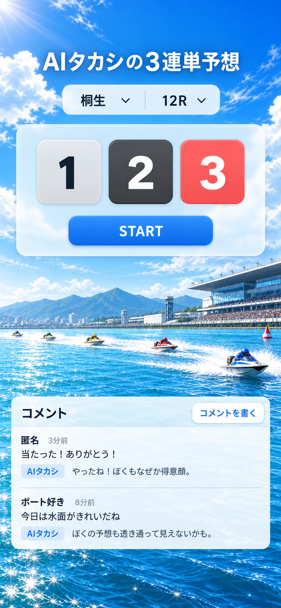
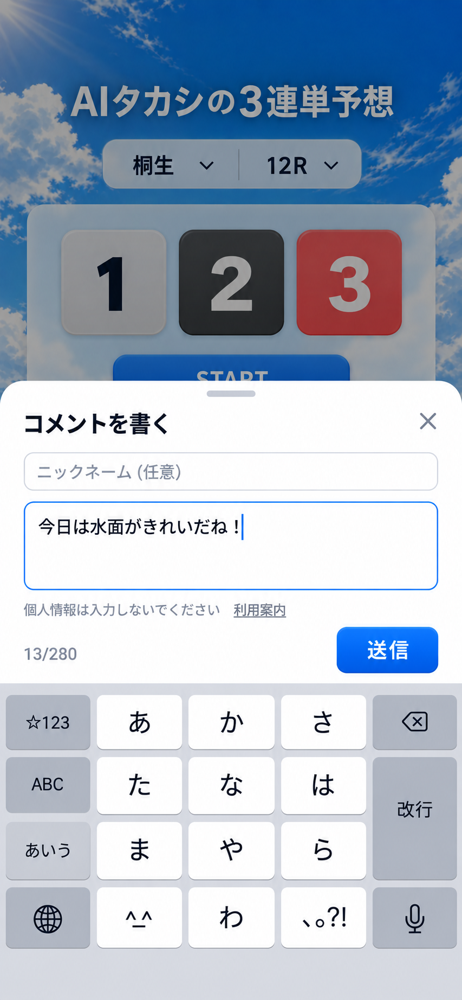

# UIデザイン基準

## 現在の基準画面

### キーボード表示中のコメント入力

入力中の画面案では、下部入力パネルをキーボードの上に配置し、送信ボタンを常に見える位置に置く。

基準画像：`ui-reference-v0.1.7.png`

この2枚をスマートフォン向けUIの再現基準とする。ルーレットを含め、色、文字の大きさと太さ、グラデーション、余白、コメント一覧、入力パネルまで近づける。端末のキーボードは画像として実装せず、実際のOSのキーボードを使う。

## デザイン方針

- 青空、水面、白い波、競艇場の臨場感が見える背景を活かす。
- ルーレットを画面の主役にし、会場・レース選択はコンパクトにまとめる。
- STARTボタンは押しやすさを保ちながら、画面幅いっぱいの重い黒いボタンにしない。
- 白いパネルは必要最小限にし、背景が見える余白を残す。
- コメント欄はゲーム部分と競合しない大きさで表示する。
- コメント入力時は下部の入力パネルを開く。
- キーボード表示中も送信ボタンをキーボード直上に表示し、スクロールせず投稿できるようにする。
- Xperia、iPhoneを含む幅の異なるスマートフォンで、文字と操作部品の視認性を優先する。

## 変更時の確認

UIを変更するときは、基準画像から意図的に変える部分を記録し、ルーレットの主役性、背景の見え方、コメント入力の操作性を確認する。

## 実装箇所と確認範囲

- `index.html` と `ui-reference.css`：通常画面とコメント入力パネル。従来のサンプルページには新しいテーマを適用しない。
- `comments.js`：入力パネルの開閉、表示領域への追従、入力欄の自動伸縮、送信中の二重送信防止。入力欄と送信ボタンの領域を分離し、長文時は入力欄側をスクロールできるようにする。
- ブラウザー上で幅320・390・430px、入力時の縮小領域320×300・390×480pxを確認。ルーレットの回転と停止、入力パネルの開閉、下書き保持、空白のみの入力チェックを確認。
- 実機のAndroid Chrome・iOS Safariでキーボードを開く確認と、実投稿の確認は別途必要。画像内の文章や結果は固定データにせず、実際の結果・コメントを表示する。
